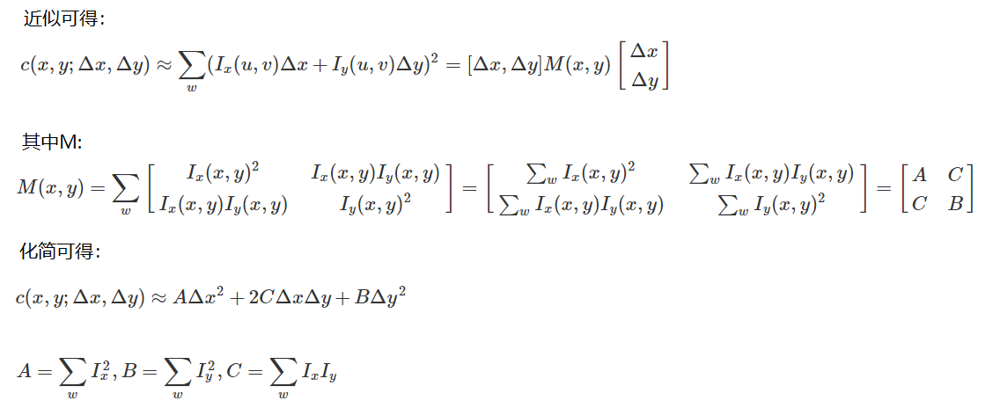
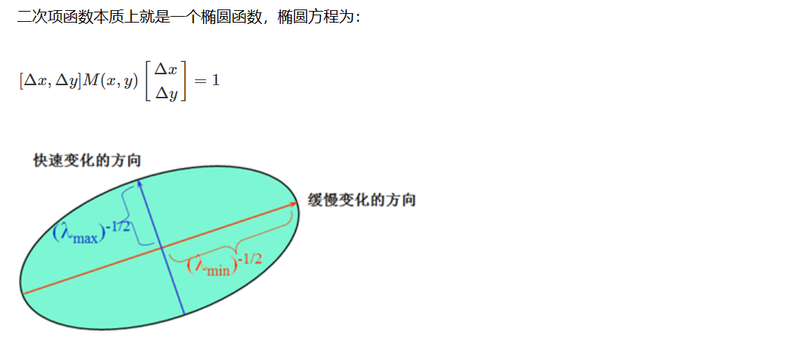
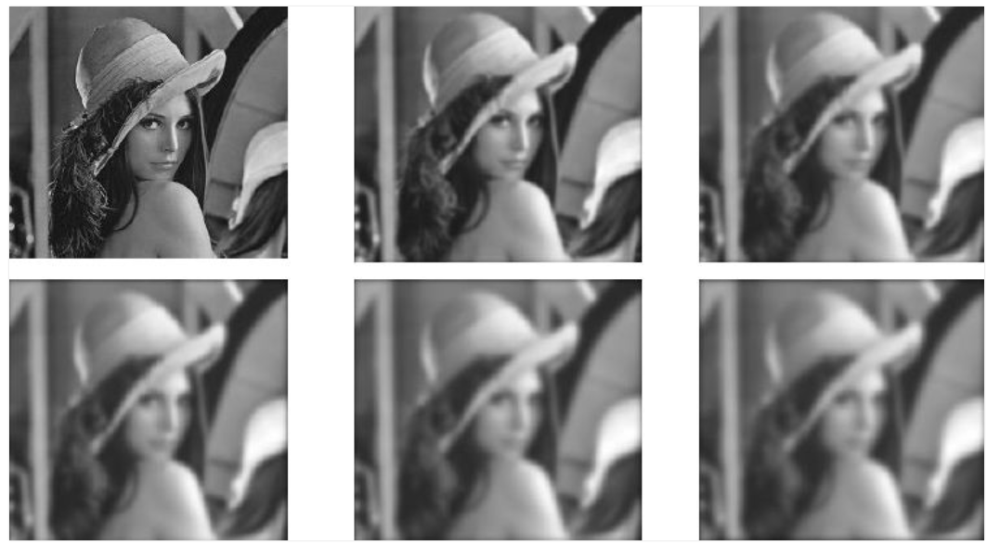

# 图像特征：

## harris：
### 1、角点检测：

### 2、基本原理：






### cv2.cornerHarris() 
- img： 数据类型为 float32 的输入图像
- blockSize： 角点检测中指定区域的大小
- ksize： Sobel求导中使用的窗口大小 
- k： 取值参数为 [0,04,0.06]

```python
import cv2
import numpy as np

img = cv2.imread('./images/test_1.jpg')
print('img.shape:', img.shape)
gray = cv2.cvtColor(img, cv2.COLOR_BGR2GRAY)
# gray = np.float32(gray)
dst = cv2.cornerHarris(gray, 2, 3, 0.04)
print('dst.shape:', dst.shape)

img[dst > 0.01 * dst.max()] = [0, 0, 255]
cv2.imshow('dst', img)
cv2.waitKey(0)
cv2.destroyAllWindows()

```

## 图像尺度空间：sift
### 图像尺度空间
- 在一定的范围内，无论物体是大还是小，人眼都可以分辨出来，然而计算机要有相同的能力却很难，所以要让机器能够对物体在不同尺度下有一个统一的认知，就需要考虑图像在不同的尺度下都存在的特点。
- 尺度空间的获取通常使用高斯模糊来实现



不同σ的高斯函数决定了对图像的平滑程度，越大的σ值对应的图像越模糊。

### 多分辨率金字塔

### 高斯差分金字塔（DOG）


### DoG空间极值检测
为了寻找尺度空间的极值点，每个像素点要和其图像域（同一尺度空间）和尺度域（相邻的尺度空间）的所有相邻点进行比较，当其大于（或者小于）所有相邻点时，该点就是极值点。如下图所示，中间的检测点要和其所在图像的3×3邻域8个像素点，以及其相邻的上下两层的3×3领域18个像素点，共26个像素点进行比较。


## 特征匹配
###  Brute-Force蛮力匹配:


